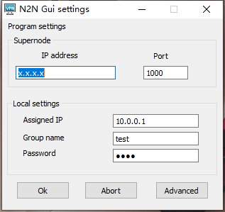

# 异地组网：n2n

### 需求：
需要将异地的能联网可编程设备组到同一个内网内，非端口透传方式

### 起因：
物联网网关设备可联网并可编程，可能无公网ip，所以异地操作网关进行命令下发时无法连接。

### 解决方案：
问题解决可以有两个方案：
1. 网关绑定动态域名，或者外网透传软件进行端口对端口的透传
2. 将网关和异地操作计算机组成同一个局域网，从而按照内网的方式进行命令下发

方案1可以在确定好通信端口的网关上实现，利用花生壳之类即可实现

方案2具有更高的操作性，此次就方案2方式进行组网

### 具体步骤：
使用n2n软件和一台有公网ip的服务器进行组网  
服务器同时兼当边缘机器进行演示步骤  
公网服务器IP:x.x.x.x  
客户机windows系统，要组成内网ip:10.0.0.1  
边缘机器centos系统，要组成内网ip:10.0.0.2  
1.服务器安装n2n
```bash
yum install subversion gcc-c++ openssl-devel git cmake
git clone https://github.com/meyerd/n2n.git
cd n2n/n2n_v2
mkdir build
cd build
cmake ..
make
make install
```

2.启动中心节点并使用端口1000
```bash
supernode -l 1000
```

3.边缘机器加入中心节点(x.x.x.x改为服务器外网节点)
```bash
edge -a 10.0.0.2 -c test -k 1234 -l x.x.x.x:1000
```

4.客户机加入中心节点  
提供一个gui程序来进行连接(见同级目录n2ngui.exe)  
设置如图


5.客户机ping 10.0.0.2, 边缘机ping 10.0.0.1  
如果ping通则组网完成
